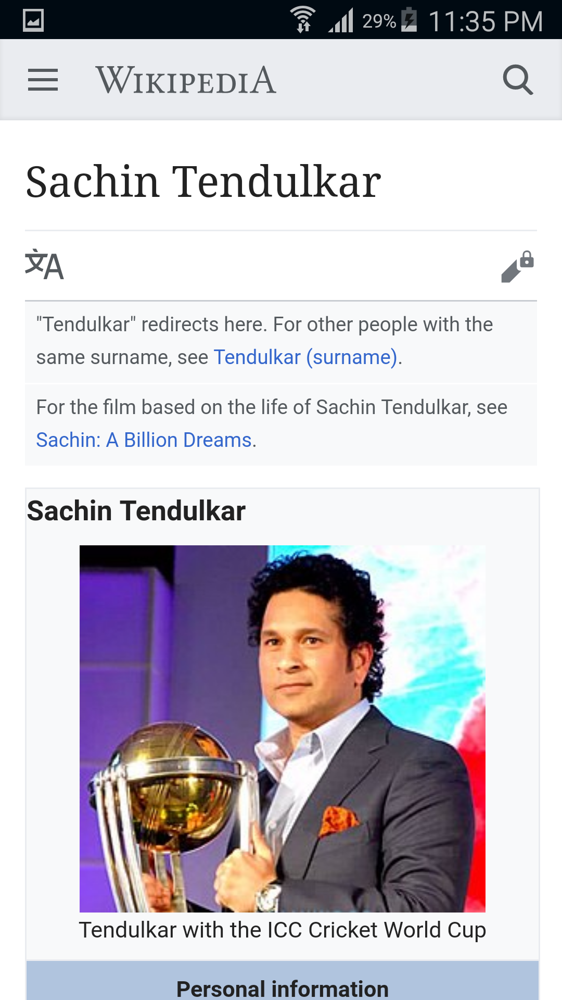

# WikiSearch
Use the Wikipedia API  to show a list of search results. 
The link contains sample API requests and an API sandbox environment to test it out. 
(For example, click this to see what a sample request/response looks like for the search query “Sachin T")

# Preview

# Library Used
- Retrofit
- ButterKnife
- GSON
- GLIDE
- MsvSearch

# Contact
- deepakp31791@gmail.com
